# Opis problemu

## Sytuacja
Chcę wprowadzić do swojego życia zdrową dietę. Zdrową tzn. taką która:
- pokrywa zapotrzebowanie na wszystkie mikroelementy (witaminy, minerały) w bilansie dziennym oraz tygodniowym
- pokrywa zapotrzebowanie na tłuszcze w bilansie tygodniowym
- pokrywa zapotrzebowanie na pro oraz pre-biotyki w bilansie dziennym oraz tygodniowym
- pokrywa zapotrzebowanie na błonnik w bilansie dziennym
- pokrywa zapotrzebowanie kaloryczne w bilansie dziennym
- pokrywa zapotrzebowanie na makroskładniki w bilansie dziennym
- maksymalizuje proces syntezy białek mięśniowych (co oznacza dostarczanie ok. 30-40g białka co 3-4 godziny, oraz dostarczenie ok. 30-40g wolnowchłanialnego białka przed snem)
- nie jest nudna i powtarzalna
- nie obciążą głowy w kwesti planowania posiłków
- pozwala na nieco luzu i spełnienie "zachcianek" (tzn. pozwala na zjedzenie od czasu do czasu czegoś niezdrowego)

Aby spełnić te potrzeby poczyniłem następujące założenia takowej diety:
- 5 posiłków dziennie o stałych porach -> w celu maskymalizacji procesu syntezy białek mięśniowych
- z góry zaplanowane posiłki na każdy dzień -> aby odciążyć głowę w kwestii planowania
- kilkutygodniowa rotacja (tzn. dni z identycznymi posiłkami występują co kilka tygodni) -> aby uniknąć nudy
- każdy posiłek musi dostarczać 30-40g białka -> w celu masymalizacji procesu syntezy białek mięśniowych 
- sumarycznie posiłki danego dnia muszą pokrywać wszystkie wymienionione wyżej zapotrzebowania rozliczane w bilansie dziennym
- sumarycznie posiłki danego tygodnia muszą pokrywać wszystkie wymienione wyżej zapotrzebowania rozliczane w bilasne tygodniowym
- niedziela jest dniem bez planowania -> w celu wprowadzenia lekkiego luzu, pozwalam wtedy sobie olać wszystkie zapotrzebowania oprócz kalorycznego oraz zjeść niezdrowy posiłek

Wprowadzenie takiej diety do życia wiążę się z dwiema fazami:
- planowanie -> stworzenie **"Diety"**, która ma określony czas trwania rotacji wyrażony w tygodniach. Każdy dzień 6-dniowego (pon-sb) tygodnia ma listę zaplanowanych posiłków. Jednocześnie należy pamiętać o pokryciu wszystkich zapotrzebowań.
- użytkowanie -> implementacja stworzonej "Diety" w życie codzienne. Wiąże się to z wykonywaniem zakupów odpowiednich składników oraz przygotowywaniem posiłków zaplanowanych na dany dzień.

Z wykorzystaniem narzędzi takich jak Notion, Google Sheets oraz ChatGPT przygotowałem swoją pierwszą **"Dietę"**. Jest ona w rotacji 4 tygodniowej. Każdy dzień zawiera 5 posiłków:
- Breakfast
- Lunch
- Pre-Workout
- Post-Workout
- Supper

Rola oraz specyfika klas posiłków wychodzi poza odpowiedzialności aplikacji. Jedyne co należy tu uwzględnić, to to że Lunch dnia `n` jest identyczny co Post-Workout dnia `n-1`. 

Na Notion mam page "Dieta" a w nim następujące sub-pages:

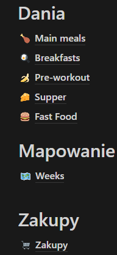

"Dania" zawierają wpisy dla poszczególnych dań. Każdy wpis składa się z tabelki składników, podsumowania makro oraz kcal i przepisu:
Notion bardzo "ładnie" renderuje te 3 informacje. Tu sięgam gdy przygotowywuje dane danie.

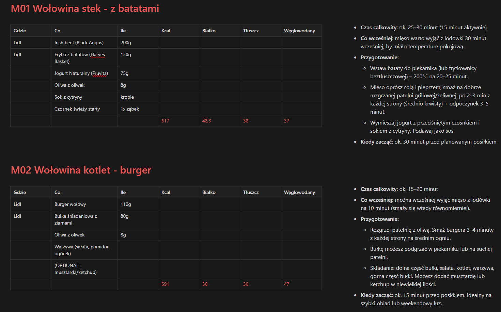

"Weeks" zawierają mapowanie wpisów z "Dania" na konkretne sloty w każdym tygodniu. Tu zerkam, gdy chcę sprawdzić co jem danego dnia.

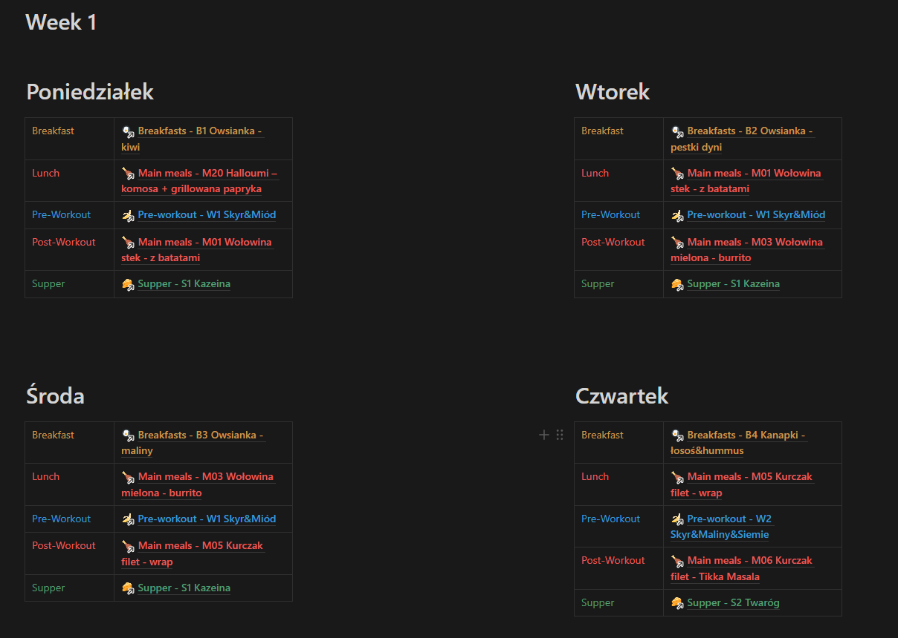

"Zakupy" zawierają listy zakupów na najbliższe 3 dni. Listy są 3:
- na jednorazowe zakupy w Lidlu
- na zakupy produktów świeżych (owoce, warzywa) dzień przed
- na zapewnienie tzw. zapasów stałych (przyprawy, oliwa z oliwek)

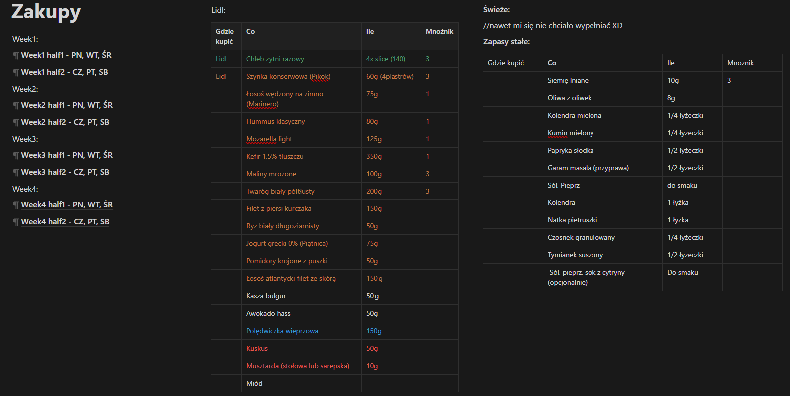

Notion użyłem podczas **fazy planowania**, aby mieć wyrenderowane potem odpowiednie informacje podczas **fazy użytkowania**. Całość rozpocząłem od stworzenia list **dań**, które potem będe wkładał w **sloty posiłkowe**:
- Main meals -> Post-Workout, Lunch
- Breakfast -> Breakfast
- Pre-Workout -> Pre-Workout
- Supper -> Supper

Gdy lista dań (oprócz Breakfast) była gotowa, rozłożyłem sobie je na każdy tydzień w Google Sheets:

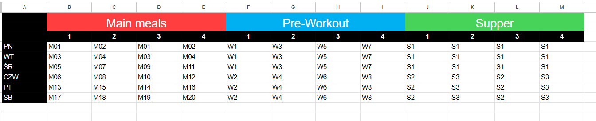

> Uwaga: każdy wpis tutaj oznacza, jakie danie przygotowuje w dany dzień, danego tygodnia w ramach danego posiłku (slotu posiłkowego). Jeśli chodzi o Main Meals, to przygotuwje po treningu dwie porcje, jedną jem jako Post-Workout, druga ląduje do pudełka stanowiąc jutrzejszy Lunch

Posiłki Pre-Workout oraz Supper to głównie samo białko. Mało w nich pokrycia zapotrzebowania na mikroelementy. Część mikroelementów pokrywają dania Main Meals, czyli Post-Workout i Lunch. Brakujące pokrycie (które różni się każdego dnia w zależności od ustalonych już posiłków) ma zostać pokryte przed Śniadania (Breakfasts). Dlatego w Google Sheets przygotowałem następującą tabelę.

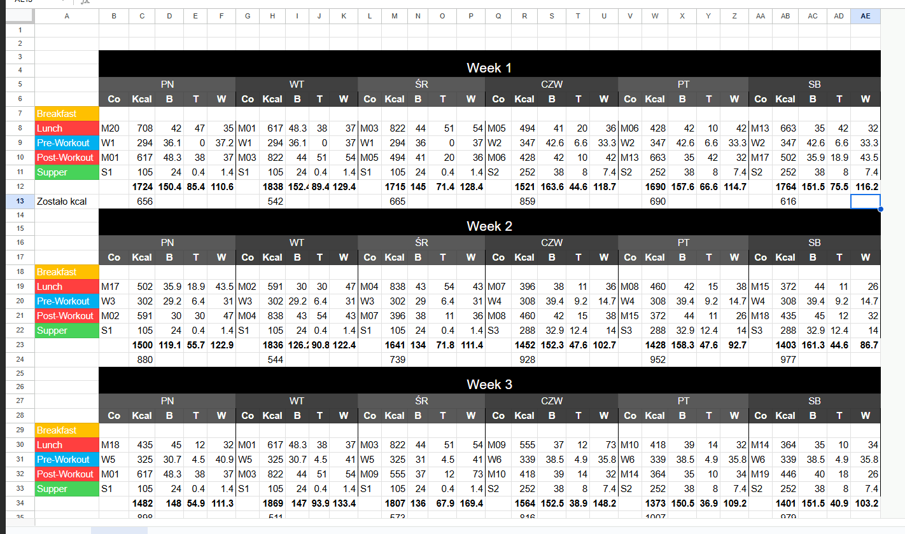

Aby wiedzieć jakie zapotrzebowania kaloryczne i makroskładnikowe w bilansie dziennym mam pokryte. Wychodząc z tego miejsca, wspólnie z czatem planowałem na każdy dzień śniadanie (tu już brak powtarzalność w obrębie pojedynczej diety, każdy dzień ma swoje customowe śniadanie). Które uwzględniają kryteria:
- pokrycie zapotrzebowania kalorycznego i makroskładników wynikające z tabelki wyżej
- pokrycie zapotrzebowań na mikroelementy, błonnik oraz pro-prebiotyki w bilansie dziennym
- pokrycie zapotrzebowań na mikroelementy i tłuszcze w bilansie tygodniowym (dlatego analizowany jest cały tydzień jednocześnie)
- pokrycie zapotrzebowania na ok. 30-40g białka na posiłek

> Oczywiście ułatwiłem sobie to zadanie przygotowując 4 tzw. bazy na śniadania: Jajecznica, Owsianka, Tosty i Kapanki. Bazy to składniki, które na pewno znajdą się w śniadaniu przez 3 dni pod rząd (ułatwienie zakupowe). Bazy też pokrywają zazwyczaj zapotrzebowanie na białko. Dodatki do baz zaś resztę zapotrzebowań.

Koniec, końców z z jakiegoś powodu w Google Sheets mam również zapisane wszystkie posiłki. Albo w celu łatwiejszego kopiowania do innych zakładek, albo w celu łatwiejszego eksportu danych do Chat'u GPT (nie pamiętam już).

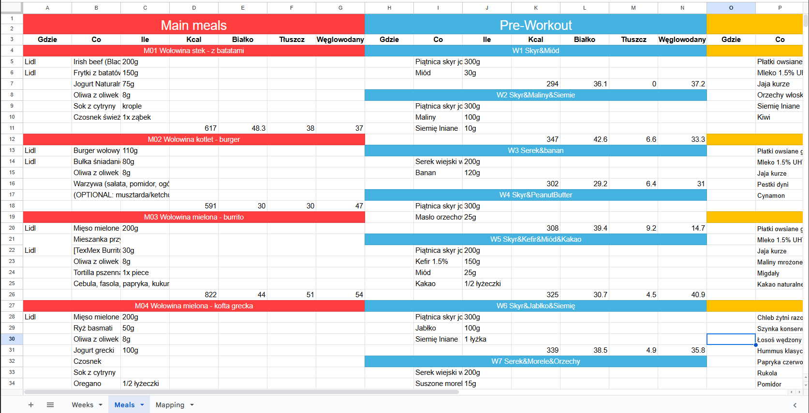

## Problem
Obecne rozwiązanie jest bardzo czasochłonne. Zarówno w fazie planowania jak i użytkowej. Nie nadaje się do wprowadzenia na stałe w życie. Cel jest taki, aby maksymalnie odciążyć sobie głowę sprawami dietowymi podczas fazy użytkowania oraz zminimalizować spędzony czas niemerytoryczny podczas fazy planowania.

Obecne rozwiązanie w fazie planowania w całości opiera się na manualnej pracy. Zero w nim automatyzacji, która mogłaby polegać na linkowaniu obiektów ze sobą czy automatycznej generacji obiektów. Praca ręczna zawiera dużo redundancji, informacje są powielane w wielu miejscach.

Problemy obecnej rozwiązania:
- w fazie planowania:
    - wielokrotne kopiowanie i wpisywanie do kolejnego dania tych samych składników
    - widok ogólny z podsumowaniem kcal i makro każdego posiłku oraz widok szczegółowy każdego posiłku trzeba robić ręcznie, z redundancją 
    - brak automatycznego wyliczania kcal i makro podczas dodawania kolejnych składników do dania (potem muszę je wpisać ponownie w Fitatu i tam "odkryć" te wartości)
    - brak automatycznego wyliczania pokrycia zapotrzebowań dziennych podczas wypełnania **slotów** daniami
    - widoki nie są natywne do tego typu zadań
    - brak szybkiego eskportu posiłków zaplanowanych na konkretny tydzień do formatu tekstowego, którym można zasilić ChatGPT (przydatne w planowaniu śniadań)
    - brak automatycznego generowania list zakupowych (kolejna redundancja)
- w fazie użytkowania
    - brak widoku "Dzisiaj", który pokazuje mi jakie dania trafiły na dzisiejsze posiłki oraz jakie zakupy (co i gdzie) muszę dziś wykonać. Stworzenie takich widoków ręcznie jest bardzo czasochłonne, narażone na błędy oraz wręcz niemożliwe w przypadku jakichkolwiek zmian. Dodatkowo i tak trzeba by było scrollować w celu odszukania odpowiedniego dnia.
    - Notion bardzo długo się renderuje, Google Sheets zaś, robi to w nieprzejrzysty sposób.

## Konsekwencje

W przypadku pozostania w rozwiązaniu obecnym każde kolejne planowanie diety będzie wiązało się z dużym, zniechęcającym wręcz nakładem pracy. Faza użytkowania również będzie czasochłonna i frustrująca, a kwestia zakupów jest wręcz niezarządzalna.

W planowaniu diety najważniejsze są aspekty merytoryczne takie jak odpowiedni dobór składników i dań, które pokrywają odpowiednie zapotrzebowania. Nieustanna moja edukacja w tym temacie będzie powodowała jeszcze wiele zmian w mojej diecie. Jeśli narzędzie, dzięki któremu wyrażam wypracowaną merytorykę jest czasochłonne, dużo mniej czasu idzie na samą merytorykę na czym traci moje zdrowie i orgaznim przez najbliższe tygodnie.

## Korzyści

W przypadku rozwiązania problemu zainwestuje pewien czas na jednorazowy development aplikacji, który zaoszczędzi mi mniejsze kwanty czasu ale rozłożone na lata, co w końcowym rezultacie opłaci się.

## Określenie zakresu rozwiązania

Rozwiązanie nie zajmuje się merytorycznym aspektem planowania diety, jest tylko narzędziem służącym do wyrażenia zaplanowanego stanu oraz optymalizuje fazę użytkowania tego stanu. Dobór składników, który pokrywa wszystkie dzienne oraz tygodniowe zapotrzebowania muszę zrobić ja - zewnętrznie. Jedyne co rozwiązanie ułatwia w tej kwestii to automatyczne wyliczenia kcal/makro dziennego podczas wypełniania slotów posiłkowych daniami lub dania podczas wypełniania go składnikami.

Rozwiązanie nie jest elastyczne pod względem ilości czy nazw posiłków. Zakładam, że z tym modelem żywienia zostanę już do końca życia. Tak samo automatyczne derywowanie Lunchu na podstawie Post-Workout z poprzedniego dnia jest natywnym mechanizmem rozwiązania.

# Wymagania użytkownika

## Przypadki użycia

| Klasa użytkownika | Przypadek użycia                                                     |
|-------------------|----------------------------------------------------------------------|
| Planista          | Provisonowanie bazy składników,   Dodawanie nowych dań,   Tworzenie diety |
| Użytkownik        | Przeglądanie zaplanowanych posiłków,   Przeglądanie list zakupowych |

# Koncepcja danych i relacji
Identyfikacja danych jako rzeczowniki występujące w poprzednich sekcjach:
- **składnik** - najmniejsza jednostka diety. Posiada nazwę, jednostkę miary (g, porcja, sztuka, kromka, łyżeczka, łyżka, opakowanie, szczypta), domyślną wartość miary, rodzaj zakupowy (Lidl, Świeże, Zapasy stałe) oraz opcjonalnie kcal, białko, tłuszcz, węglowodany na porcję adekwatną do jednostki miary (np. dla `g` dla `100g`). Przykład składnika to `Irish beef (Black Angus), g, 200, Lidl, 137, 21, 4, 0.`
- **danie** - Posiada nazwę, listę par składnik-ilość, makro (kcal, białko tłuszcz, węglowodany), listę labeli (redu, masa, kurczak), rodzaj posiłku (Breakfast, Main Meal, Pre-Workout, Supper) oraz opcjonalny przepis (w formacie {Czas całkowity, Co wcześniej, Przygotowanie, Kiedy zacząć}). Przykład dania to `M01 Wołowina Stek, [{Irish beef (black angus), 200}, {Frytki z batatów (Harvest Basket), 150}, {Jogurt naturalny (Fruvita), 75}, {Oliwa z oliwek, 6}, {Sok z cytryny, 1}, {czosnek świeży starty, 1}], [redu, wołowina], Main Meal, {{Czas całkowity: 25min (15min aktywnie)}, {Co wcześniej: {mięso warto wyjąć z lodówki 30 min wcześniej by miało temp. pokojową.},...}}}`
- **dieta** - Posiada nazwę, opis tekstowy, listę labeli, liczbę tygodni oraz mapowanie odpowiednich dań na sloty posiłkowe w każdym dniu każdego tygodnia
- **slot posiłkowy** - budulec diety. Dieta ma ich tyle ile liczba jej tygodni razy 6 razy 5. Jeden slot posiłkowy to trójka `{week, day, meal}` np. `{2, PN, breakfast}`.
- **dzień** - budulec diety. Dieta ma ich tyle ile liczba jej tygodni raz 6. Dzień to widok (w bazodanowym tego słowa znaczeniu) kawałka diety, który pokazuje mapowanie dań na sloty posiłkowe, tam gdzie `{week, day}` ma odpowiednie wartości. 
- **lista zakupów** - jest to funkcja gdzie wejściowymi jest dieta oraz konkretny dzień diety (dwójka `{week, day`}). Funkcja zwraca listę składników (wraz z podziałem na kategorie zakupowe), które trzeba zakupić danego dnia według reguły biznesowej 1.

## Biznesowe ERD

## Koncepcyjne ERD

## Wymagania danych
Pytania pomocnicze:
- **Jakich danych wymaga każda składowa rozwiązania? Jakie są ich źródła?**
    - Rozwiązanie dzielimy na dwa moduły: Planowanie oraz Użytkowanie.
    - Planowanie wymaga bazy składników, która jest provisonowana przez użytkownika, dań, które również tworzone są przez użytkonwnika oraz diety, która również tworzona jest przez użytkownika
    - Użytkowanie musi wiedzieć, która dieta jest aktywna (tzn. w użyciu) oraz mapować dzisiejszą datę na odpowiedni dzień diety (odpowiednie sloty). Na tej podstawie moduł ustawia wskaźnik na odpowiednie sloty diety i generuje widoki posiłków oraz listy zakupów.
- **Jakie dane, które powinny być trwale przechowywane, produkuje każda składowa?**
    - Moduł planowania produkuje wszystkie dane (składniki, dania, diety, powiązanie daty z dniem diety).
    - Moduł użytkownika nie produkuje danych, które są trwale przechowywane. (może ewentualnie w przyszłości oznaczać zapas stały jako brakujący).
- **Jakie obiekty danych są wejściem lub wyjściem dla jednostek zewnętrznych w stosunku do rozwiązania? Za pomocą jakich mechanimzów dane będą odbierane i wysyłane?**
    - Moduł planowania: system zewnętrzne: użytkownik: wyjście: składniki, dania, diety, powiązanie daty z dniem diety; wejście: export składników, dań, diety do pliku tekstowego (zrozumiałego np. dla ChataGPT).
    - Moduł użytkownika: brak
- **Jakie ograniczenia, reguły biznesowe lub zależności dotyczą każdego obiektu danych?**
    - atrybuty wraz z enumami zostały opisane wyżej. Regułą biznesową na pewno jest derywacja posiłku Lunch na podstawie Post-Workout dnia poprzedniego.
- **Który system lub proces jest "ownerem" dla każdego obiektu danych?**
    - Ownerem wszystkich danych jest moduł planowania.
- **Jakie informacje muszą być wprowadzone lub wyświetlane w interfejsie użytkownika?**
    - Moduł planowania: Widok provisonowania składników, Widok tworzenia dań, Widok tworzenia diety.
    - Moduł użytkowania: Widok dzisiaj zawierający dwie sekcje: posiłki oraz listy zakupów

## CRUDCLUMT
| Operacja        | Składnik                                                     | Danie                                                        | Dieta                                                        |
| --------------- | ------------------------------------------------------------ | ------------------------------------------------------------ | ------------------------------------------------------------ |
| **C**reate      | Planista provisonuje baze składników albo ręcznie albo przez bulk provisioning | Planista provisonuje baze dań (tylko ręcznie)                | Planista provisonuje baze diet (tylko ręcznie)               |
| **R**ead        | Planista przegląda bazę składników lub rowija szczegóły dania | Planista przegląda baze dań lub sloty diety                  | Planista provisonuje baze diet, generowanie widoku "dzisiaj" |
| **U**pdate      | Planista provisonuje baze składników                         | Planista provisonuje baze dań                                | Planista provisonuje baze diet                               |
| **D**elete      | Planista provisonuje baze składników                         | Planista provisonuje baze dań                                | Planista provisonuje baze diet                               |
| **C**opied      | Nigdy                                                        | Nigdy                                                        | Nigdy                                                        |
| **L**ist        | Planista provisonuje baze składników                         | Planista provisonuje baze dań                                | Planista provisonuje baze diet                               |
| **U**sed        | Liczenie kcal/makro dania                                    | Liczenie kcal/makro dnia lub tygodnia diety, generowanie widoku "dzisiaj" (zarówno posiłki jak i zakupy) | Generowanie widoku "dzisiaj"                                 |
| **M**oved       | Nigdy                                                        | Nigdy                                                        | Nigdy                                                        |
| **T**ransformed | Nigdy                                                        | Nigdy                                                        | Nigdy                                                        |

# Atrybuty jakościowe

| Atrybuty                 | Zewnętrzne                                                   | Atrybuty                       | Wewnętrzne                                                   |
| ------------------------ | ------------------------------------------------------------ | ------------------------------ | ------------------------------------------------------------ |
| **Dostępność**           | System dostępny jest w dowolnym momencie. Planowanie desktop, użytkowanie mobilnie (najlepiej z poziomu ikonki) | **Efektywność**                | Niekoniecznie, projekt i tak jest mały.                      |
| **Możliwość instalacji** | Użytkownik nie musi nic instalować (chyba, że zdecyduje się na aplikacje mobilną do fazy użytkowania) | **Rozszerzalność**             | Zakładam, że baza pozostanie, ale projekt będzie dokładał jakieś małe ficzery (mikroelementy do składników, listy zakupów z check'iem, propozycje dań na niedziele) |
| **Integralność**         | Dane powinny być sprawdzane pod względem duplikatów, powności enumów itp. | **Utrzymywalność**             | Jeśli projekt ma zostać ze mną na "całe życie" to maksujm to |
| **Interoperacyjność**    | Brak integracji, moduł planowania umożliwia jedynie export do pliku diety w celu planowania wspólnie z czatem | **Modyfikowalność**            | j.w.                                                         |
| **Wydajność**            | Renderowane strony web są lightweight, widok "dzisiaj" statyczny | **Przenośność**                | Zapewnione cloud-native                                      |
| **Wytrzymałość**         | Obsługa błędów musi być                                      | **Możliwość ponownego użycia** | Tam gdzie możliwe, przenośność komponentów UI mile widziana  |
| **Bezpieczeństwo**       | Brak danych poufnych, przeciwko ewentualnym DDoS'om na serwer można zabezpieczyć się backupem kodu (github) + backupem bazy (zrzut sql do replikacji, po planowaniu np.) | **Skalowalność**               | Możliwe, że znajomi będą chcieli też z tego korzystać. Zakładam skalowanie poprzez cloud-native |
| **Użyteczność**          | UI powinna odzwierciedlić to co jest w Sheets/Notion, ale z natywnym wsparciem reguł biznesowych (np. wybieranie składników po nazwie wpisywanej z klawiatury itp.). Jeśli chodzi o kolory to telefon i tak mam czarno-biały. | **Weryfikowalność**            | Zakładam TDD                                                 |

# Wymagania rozwiązania
Na google sheets -> https://docs.google.com/spreadsheets/d/1SR5CmXeaMDojR8Uv-b5A2uDPSgCzc1pa7ivqYV27y-U/edit?usp=sharing
# Prototypy

## PW.1
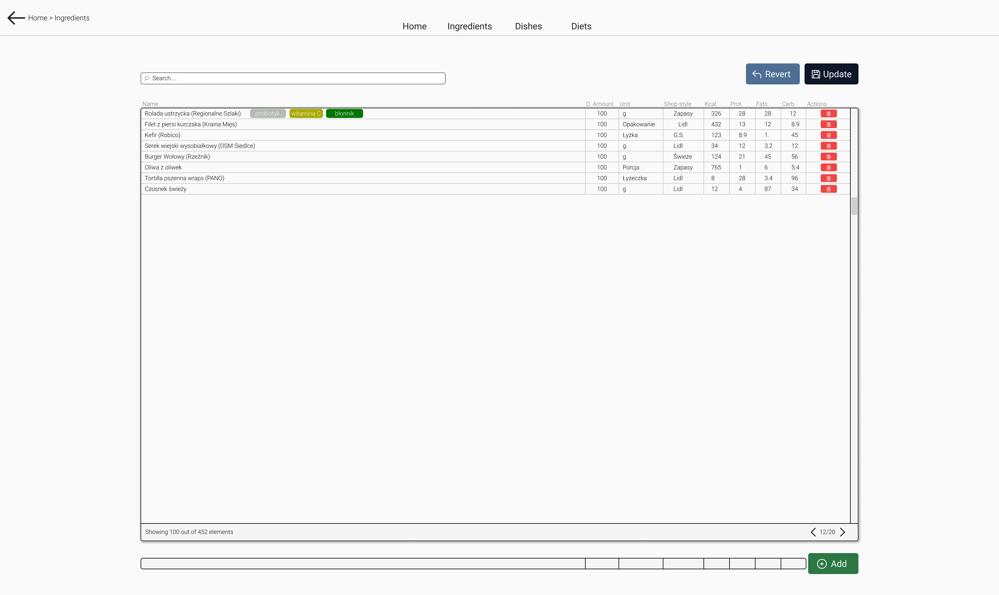
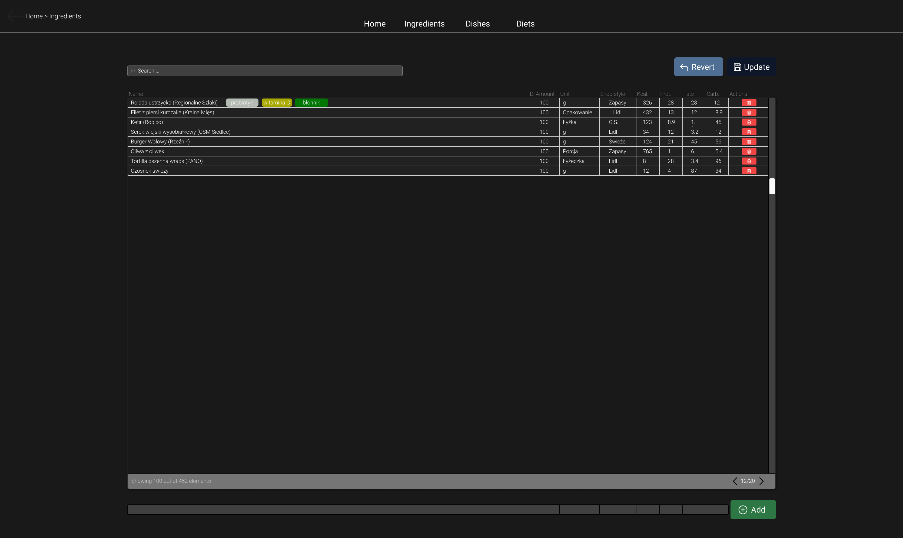

## PW.2
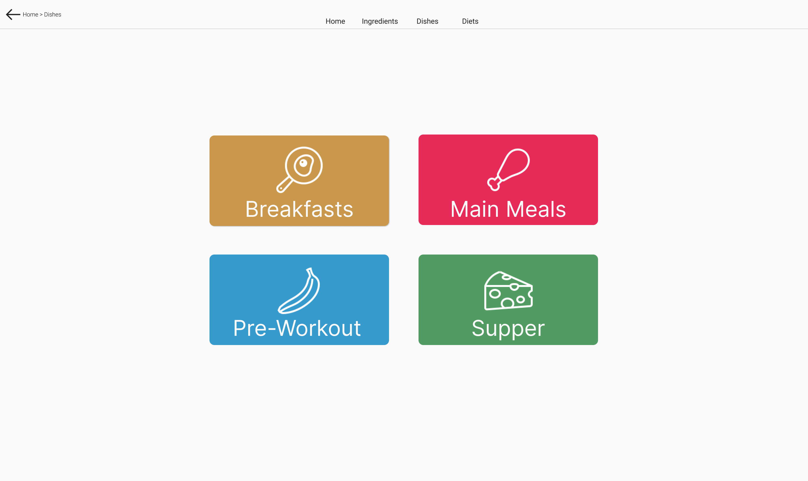

### PW.2.X
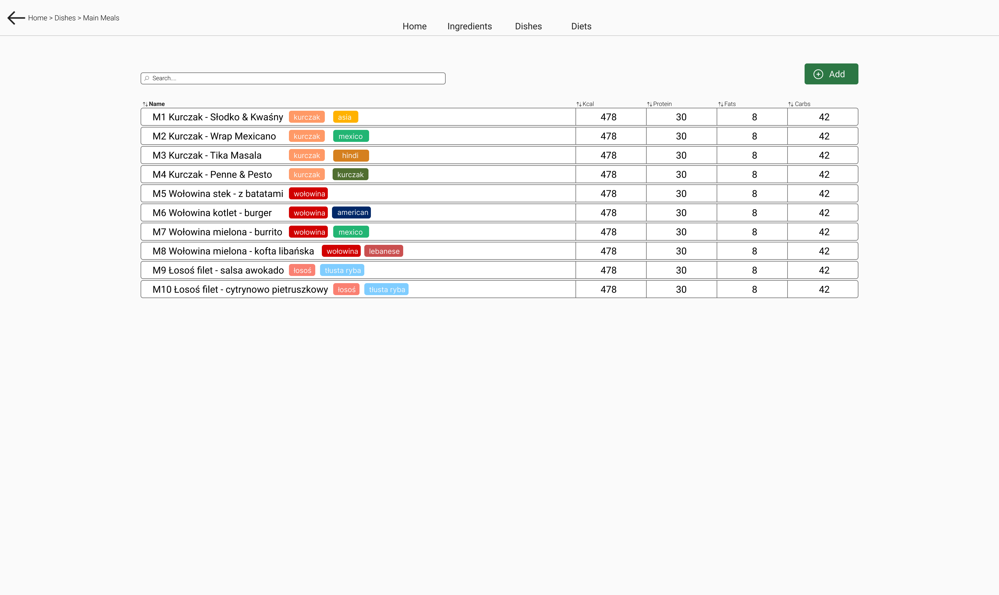

### PW.2.X.1
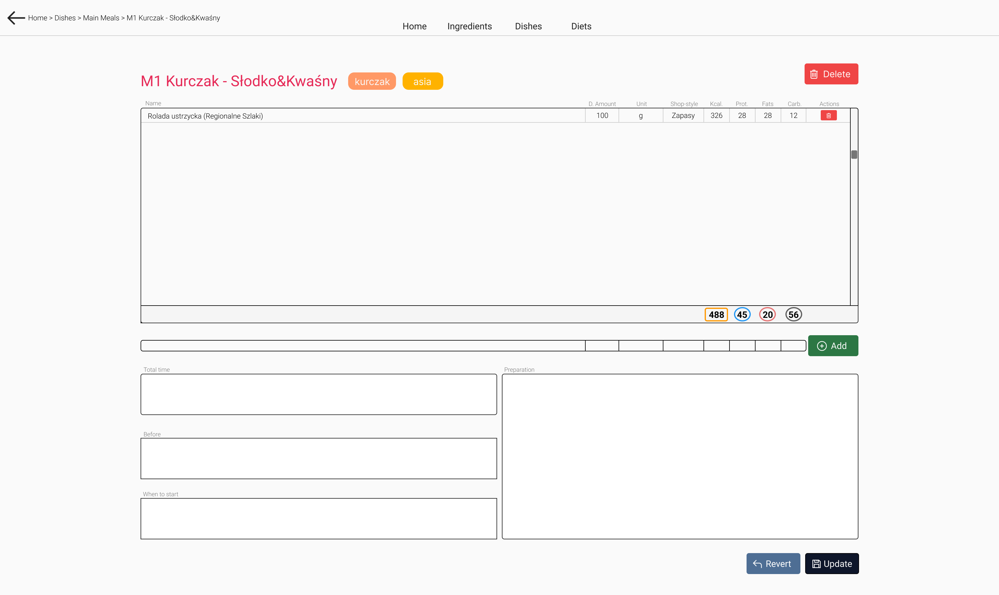
## PW.3
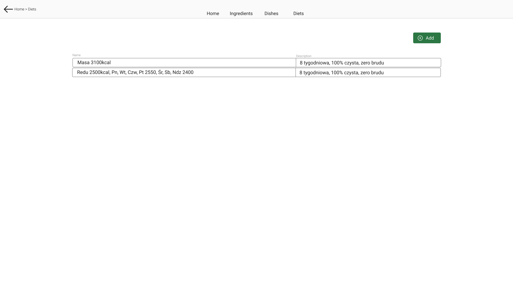
### PW.3.1
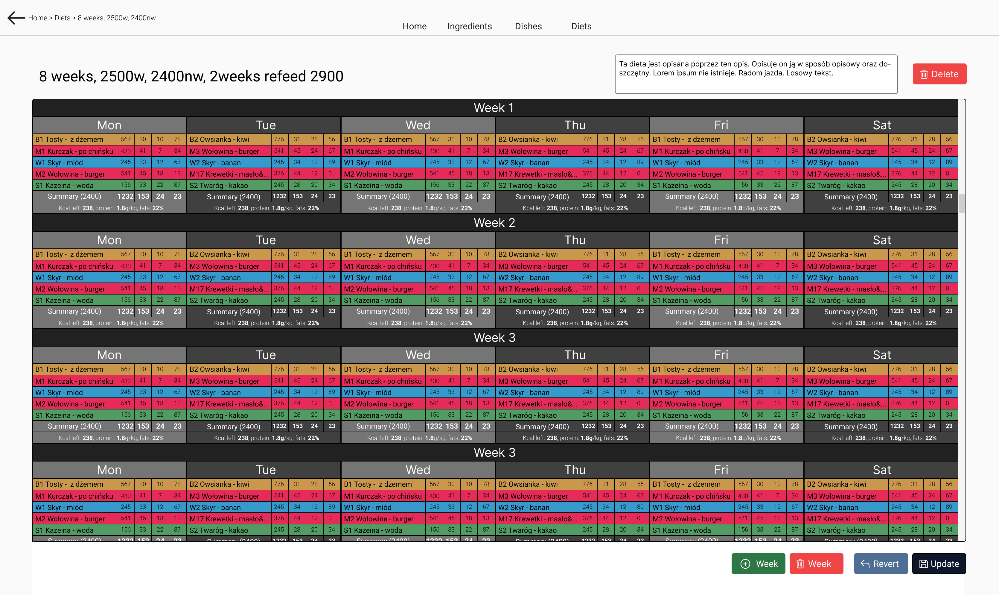

## PW.4
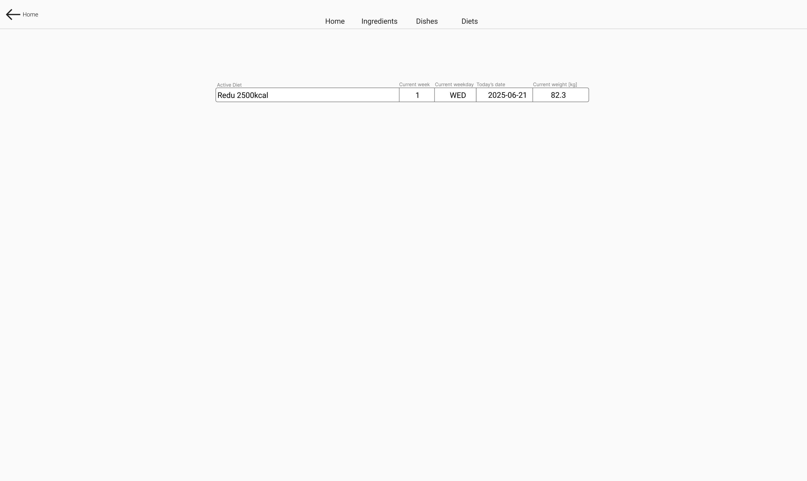